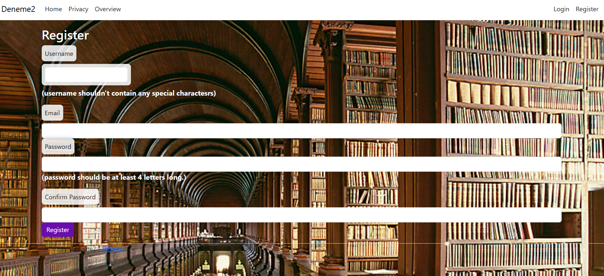
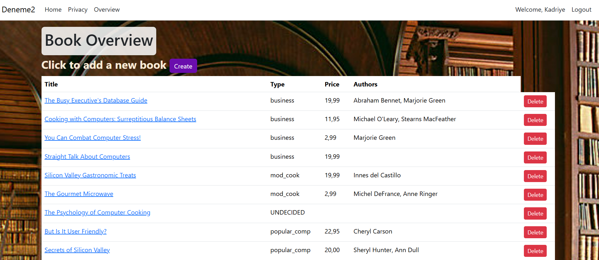
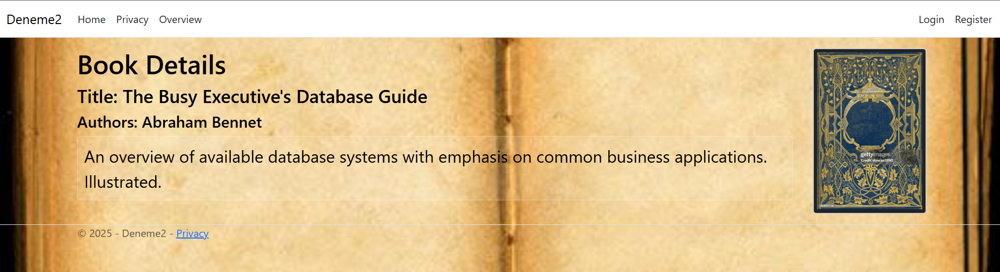

# 📚 BookStoresWebAPI

Hi! I'm Kadriye 👋  
This project was developed during my internship as part of my learning journey with **ASP.NET Core** and backend development.  
The app is a basic book store web application with full authentication, role-based access, REST API integration, and dynamic validation.

---

## 🎯 Project Overview

BookStoresWebAPI allows users to **register**, **login**, and browse a collection of books.  
It includes user roles and permission-based UI and action control.

---

## 🧩 Key Features

- 🔐 **User Registration & Login**
  - Real-time username availability check (via AJAX)
  - Password & form validation
- 📚 **Book Overview Page**
  - All users can view available books
  - Click on a book name to view **detailed info** (book name, description, cover image if exists)
- 🧠 **Role-Based Access**
  - If a user is seeded as `Admin`, they can:
    - Add a new book via a Create page
    - Delete any book
    - Edit book details (including changing text or uploading a cover image)
- ⚠️ **Security**
  - Only Admins can access modification pages
  - Unauthorized users **cannot bypass** security by typing URLs manually
  - Server-side checks enforce roles

---

## 📷 Screenshots 

Place these in a `screenshots/` folder and reference them below:
- ⭐️ Register page (with live username check)
- ⭐️ Overview page (list of books)
- ⭐️ Detail page of a book
- ⭐️ Admin-only "Create Book" and "Edit Book" views



Register AJAX


Book Overview


Book Details


Admin Book Details

## 🧱 Technologies Used

| Stack               | Purpose                                  |
|---------------------|-------------------------------------------|
| ASP.NET Core MVC    | Web framework                            |
| ASP.NET Identity    | Authentication & user management         |
| Entity Framework    | Database ORM                             |
| Serilog             | Logging                                   |
| JavaScript / AJAX   | Live validation & UI feedback            |
| SQL Server / LocalDB| Backend database                         |
| xUnit + Moq         | Unit testing                             |

---

## ⚙️ Project Setup

1. Clone the repository:
```bash
git clone https://github.com/yourusername/BookStoresWebAPI.git
cd BookStoresWebAPI
```

2. Make sure your `appsettings.json` has the correct connection string.

3. Run database migrations:
```bash
dotnet ef database update
```

4. Run the project:
```bash
dotnet run
```

---

## 🧪 Unit Testing

The solution includes a separate test project using `xUnit` and `Moq`.

Currently tested functionality:
- ✅ Username availability check (via mocked `UserManager`)
- ✅ You can add more unit tests easily for other business logic

---

## 🌐 REST API Support

Includes an API controller (`BooksApiController`) that serves book data as JSON under:

```
GET     /api/BooksApi
POST    /api/BooksApi
DELETE  /api/BooksApi/{id}
```

This is useful for extending the app into a frontend SPA or mobile app in the future.

---

## 📦 Folder Structure (Simplified)

```
📁 Controllers
    ├── AccountController.cs       // Authentication
    ├── ItemsController.cs         // Book overview / detail / create-delete
    └── BooksApiController.cs      // REST API
📁 Models
📁 ViewModel
📁 Views
📁 wwwroot
📁 UnitTestProject_BookStoresApp
```

---

## 👩‍💻 Author

**Kadriye**  
Developed during my internship to explore and apply ASP.NET Core MVC, Identity, and backend concepts in a real-world-like scenario.  
Feel free to fork, suggest, or contribute!  
Let’s connect on [GitHub](https://github.com/kadochann)

---

## ✅ License

This project is licensed under the MIT License — use freely, just give credit.


